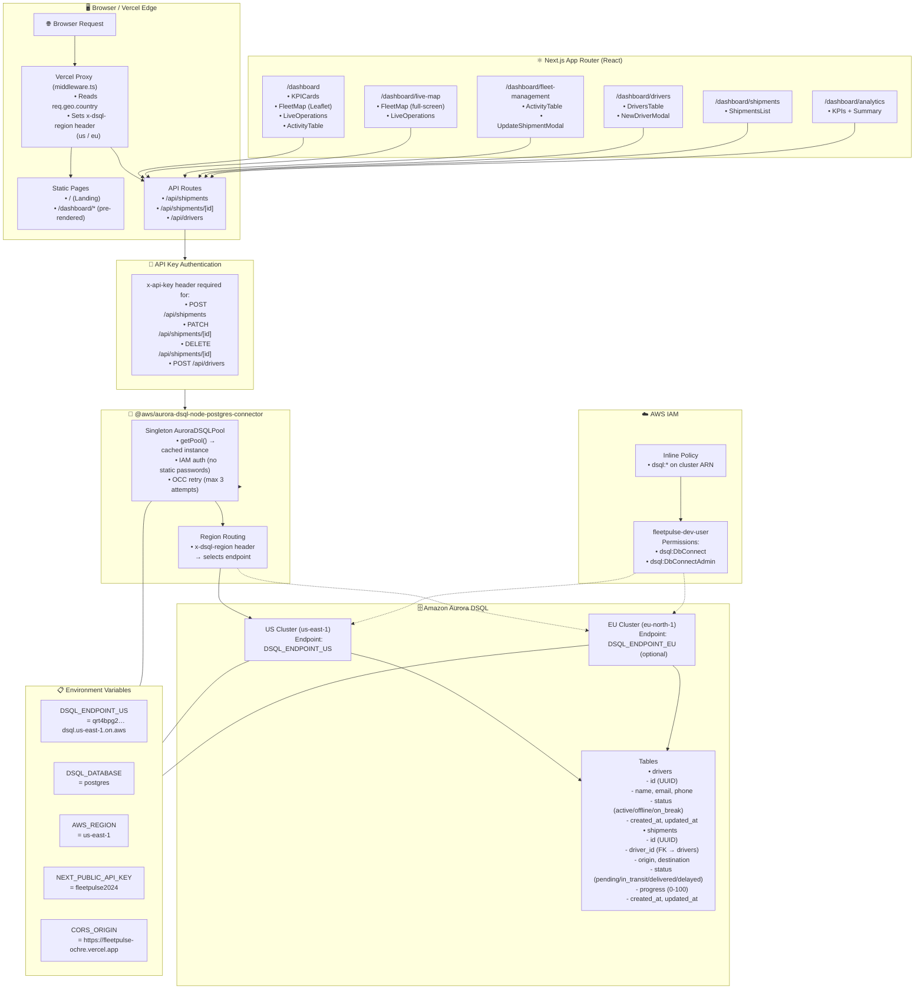

# FleetPulse — System Architecture



## Data Flow

```
User → Browser → Vercel Edge (Proxy)
                      │
                      ├── x-dsql-region: "us" | "eu"
                      │
                      ▼
               Next.js API Route
                      │
                      ├── x-api-key check (writes only)
                      │
                      ▼
               lib/db.ts (getPool)
                      │
                      ├── IAM token generation
                      ├── OCC retry wrapper
                      │
                      ▼
               Aurora DSQL Cluster
                      │
                      ├── query("SELECT …")
                      │
                      ▼
               JSON Response → Browser
```

## Key Design Decisions

| Decision | Rationale |
|---|---|
| **IAM auth** (no passwords) | Aurora DSQL requires IAM-based credentials. Static passwords are not supported. |
| **Singleton pool** | Prevents connection exhaustion on serverless cold starts. The pool is reused across requests. |
| **OCC retry** (3 attempts, 100ms max delay) | Aurora DSQL uses optimistic concurrency control. Writes can fail with serialisation errors and must be retried. |
| **Region routing via header** | Middleware sets `x-dsql-region` based on `req.geo.country`. Adding an EU cluster later only requires setting `DSQL_ENDPOINT_EU` — no code changes. |
| **API key on writes** | Public reads (GET) are unauthenticated. Writes (POST/PATCH/DELETE) require `x-api-key` to prevent abuse. |
| **SSR-safe Leaflet** | Leaflet accesses `window` during module init. Dynamic import with `ssr: false` + mount guard prevents build errors. |
| **30-second polling** | Simple and reliable for hackathon scale. Can be upgraded to WebSockets or Server-Sent Events later. |